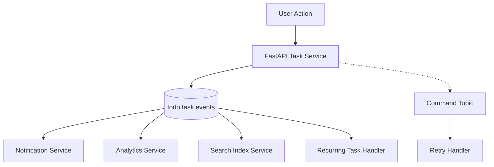
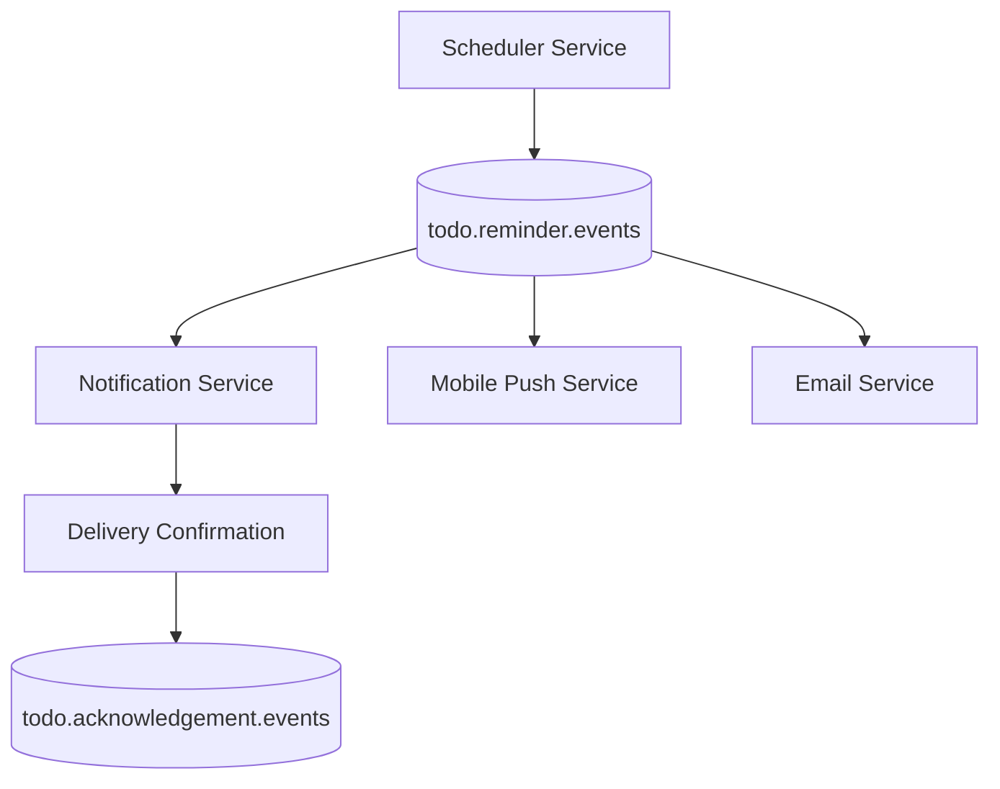
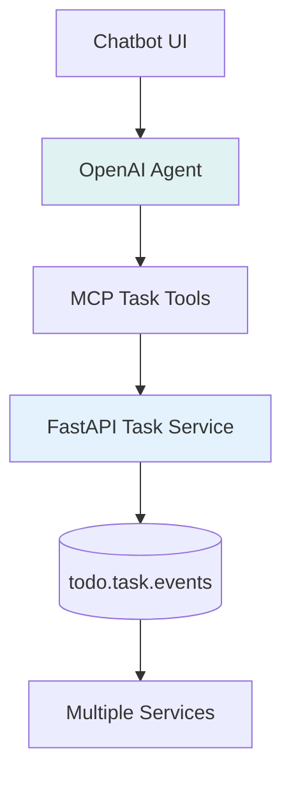
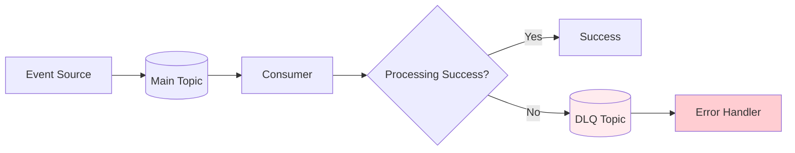
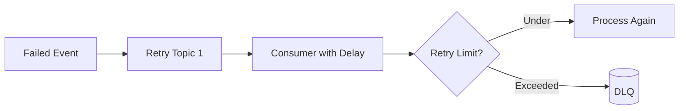

# Design Event Flows

This skill helps create comprehensive flow specifications for event-driven architecture in a Todo application, including text descriptions and Mermaid diagram code showing end-to-end event paths.

## When to Use This Skill

Use this skill when:
- Designing event-driven architecture for Todo application services
- Planning message routing between FastAPI, chatbot, and consumer services
- Creating Kafka topic architectures and consumer groups
- Documenting event flow patterns for team understanding
- Planning publisher-subscriber relationships
- Designing message routing and filtering strategies

## Event Flow Design Process

### 1. Identify Event Publishers

Document all services that publish events:

**FastAPI Task Service:**
- Publishes task lifecycle events (created, updated, completed, deleted)
- Handles user-triggered actions
- Emits events synchronously after database commits

**Chatbot Service:**
- Publishes natural language processed events
- Translates user commands into task operations
- Emits events based on agent interpretations

**Scheduler Service:**
- Publishes time-based events (reminders, recurring tasks)
- Handles cron-like scheduling
- Emits events at predetermined intervals

### 2. Identify Event Consumers

Document all services that consume events:

**Notification Service:**
- Consumes reminder and task update events
- Sends email, push, or in-app notifications
- May filter events by user preferences

**Analytics Service:**
- Consumes all user interaction events
- Builds user behavior and usage metrics
- Aggregates data for reporting

**Recurring Task Service:**
- Consumes task completion events
- Generates new instances of recurring tasks
- Updates schedule based on recurrence rules

### 3. Define Topic Architecture

Design Kafka topic structure:

```
Topics:
- todo.task.commands - Commands to modify tasks
- todo.task.events - Task lifecycle events
- todo.user.events - User-related events
- todo.reminder.events - Reminder and scheduling events
- todo.analytics.events - Analytics-destined events
```

### 4. Create Flow Specifications

For each event flow, define:

**Text Specification:**
```
Flow: Task Created Event
1. User creates task via UI
2. Frontend sends request to FastAPI
3. FastAPI validates and persists task
4. FastAPI publishes task.created event to todo.task.events
5. Notification service consumes event and sends notification
6. Analytics service consumes event and updates metrics
```

**Mermaid Diagram:**
```
graph LR
    A[User] --> B[Frontend]
    B --> C[FastAPI Task Service]
    C --> D[(todo.task.events Topic)]
    D --> E[Notification Service]
    D --> F[Analytics Service]
    D --> G[Recurring Task Service]

    style A fill:#e1f5fe
    style D fill:#fff3e0
    style E fill:#f3e5f5
    style F fill:#e8f5e8
    style G fill:#fff8e1
```

## Common Event Flows

### Task Lifecycle Flow


### Reminder Flow


### Natural Language Command Flow


## Message Routing Patterns

### Topic-Based Routing
- Single topic per event category
- Multiple consumers subscribe to same topic
- Simple fan-out pattern

### Partitioning Strategy
- Partition by userId for ordered processing
- Partition by taskId for consistency
- Balance between parallelism and ordering

### Consumer Groups
- Separate consumer groups for different purposes
- Independent offset management
- Scalable consumption patterns

## Error Handling Flows

### Dead Letter Queue Pattern


### Retry Pattern


## Flow Documentation Template

For each flow, document:

1. **Flow Name:** Descriptive name
2. **Description:** What the flow accomplishes
3. **Participants:** Services involved
4. **Sequence:** Step-by-step flow
5. **Topics:** Kafka topics used
6. **Filters:** Event filtering criteria
7. **Error Handling:** Failure scenarios and recovery
8. **Performance:** Expected throughput and latency
9. **Diagram:** Mermaid visualization

## Output Format

Generate comprehensive flow documentation with:

**Flow Title:** [Name of the flow]

**Description:** [Purpose and scope of the flow]

**Participants:**
- Publisher: [Service name and role]
- Topics: [List of Kafka topics]
- Subscribers: [List of consuming services]

**Sequence:**
1. [Step 1 description]
2. [Step 2 description]
...

**Mermaid Diagram:**
```
[Mermaid code here]
```

**Error Handling:** [Failure scenarios and recovery mechanisms]

**Performance Expectations:** [Throughput, latency, etc.]

This approach ensures comprehensive documentation of all event flows in the system with both textual descriptions and visual representations.