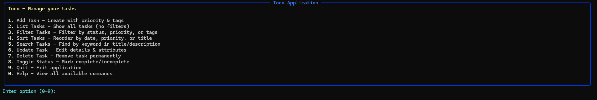

# Hackathon-II

### Documentation

Read the given documentation [here](https://docs.google.com/document/d/1KHxeDNnqG9uew-rEabQc5H8u3VmEN3OaJ_A1ZVVr9vY).

## Phase 1 (Completed)

- Build a Todo In-Memory Python Console App

---

---

## Phase 2 (Completed)

- Build a Todo Full-Stack Web Application
- App Link [Taskify](https://taskify-osamabinadnan.vercel.app/)

---

---

## Phase 3 (Completed)
- Build and Integrate Todo AI Chatbot in Phase 2 Full-Stack Web Application which can perform task related CRUD operations
- App Link [Taskify AI Chatbot](https://taskify-with-chatbot-osamabinadnan.vercel.app/)

---

---

## Phase 4 (Completed)

- Build a Todo Application with local kubernetes deployment.
- Deploy the Todo AI Chatbot application to a local Kubernetes cluster using Minikube
- Containerize both frontend and backend applications with Docker
- Package applications using Helm charts for easy deployment
- Implement AI-assisted DevOps operations using Gordon, kubectl-ai, and kagent

---

---

## Phase 5 (Not Started Yet)

- Build a Advance Todo Application with local kubernetes setup and production-ready deployment on cloud.

These projects are part of a hackathon demonstration of spec-driven development, given by [panaverity](https://panaversity.org/).